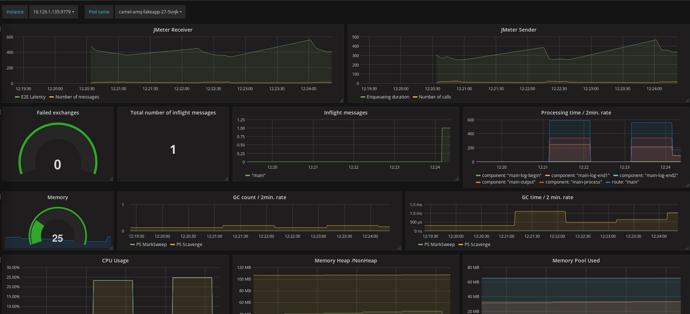

= Grafana
ifdef::env-github[]
:tip-caption: :bulb:
:note-caption: :information_source:
:important-caption: :heavy_exclamation_mark:
:caution-caption: :fire:
:warning-caption: :warning:
endif::[]
ifndef::env-github[]
:imagesdir: ./
endif::[]
:toc:
:toc-placement!:

== Installation

A playbook is available for deploying Grafana on the machine used for the OpenShift installation:

 $ ansible-playbook -vvv -i your.inventory /usr/share/ansible/openshift-ansible/playbooks/openshift-grafana/config.yml

Alternatively, the ansible playbook broker can be used for installinng Grafana together with Prometheus, see https://github.com/ansibleplaybookbundle/prometheus-apb[here].

NOTE:  Things are evolving quickly in this realm and an operator, configurable during the ansible installation is available with OpenShift 3.11 for installing and managing Prometheus & Grafana.

== Data sources

Once you have logged into Grafana the first thing is to configure the datasources.

=== Prometheus

Select the Grafana icon menu on the top left, click on "Data Sources" and the "Add Data Source" button. A few fields need then to be filled in.

....
Name: A name needs to be given to the data source I chose DS_PROMETHEUS
Type: Prometheus
URL: https://prometheus-openshift-metrics.apps.sandbox.com/ (change to your Prometheus route)
Access: Server/proxy (named differently depending on the Grafana version)
Skip TLS Verification (Insecure): If you don't have a CA configured
Token (under "Prometheus settings"): set to the result of: `$ oc serviceaccounts get-token prometheus-reader -n openshift-metrics`
....

=== InfluxDB

The configuration of the InfluxDB is covered under <<../../jmeter/observability/README.adoc#,JMeter>>. The steps are repeated here for convenience.

Select the Grafana icon menu on the top left, click on "Data Sources" and the "Add Data Source" button. A few fields need then to be filled in.

....
Name: A name needs to be given to the data source I chose DS_INFLUXDB
Type: InfluxDB
URL: http://influxdb-1x.perftest.svc:8086 (change to your InfluxDB service)
Access: Server/proxy (named differently depending on the Grafana version)
No authentication was configured in this demo
Database: jmeter
....

== Dashboards

Prometheus metrics are scraped every 30s and can be used along the time series that have been recorded into InfluxDB for the JMeter runs.
A sample dashboard has been created. It can be uploaded with the following steps

* Click on the Grafana icon menu on the top left and select Dashboards
* Click on "New dashboard"
* Click on the "Import Dashboard" button
* Select "Upload .json File" button
* Pick the json file available in this directory

Here is how it looks like

